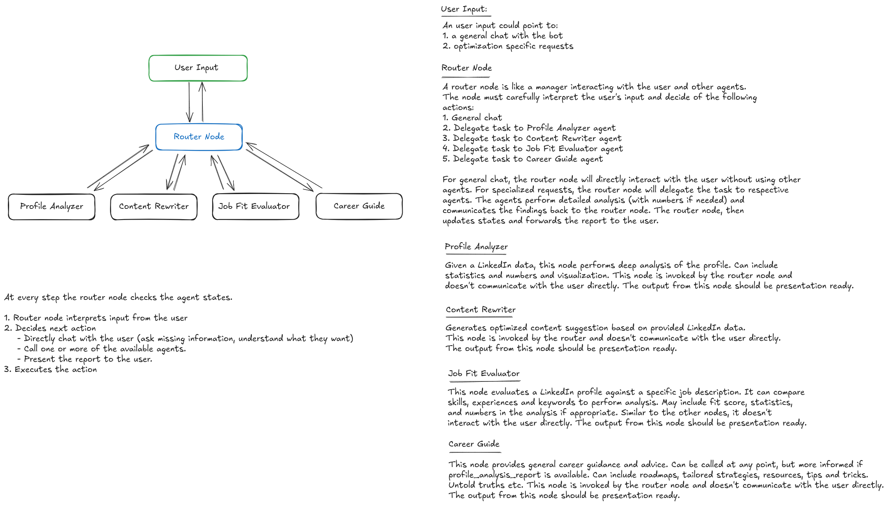

# LinkedIn Assistant 🧞‍♂️

> **An AI-powered career assistant that transforms your LinkedIn profile, evaluates job fit, and guides your job search with smart, personalized insights.**


[](https://python.org)
[](https://langchain.com)
[](https://langgraph.com)
[](https://streamlit.io)
[](https://docker.com)

## Features
**Important Note:** 
When interacting with the bot through the terminal, ensure inputs are provided in a single line without line breaks. The bot is designed to handle single-line inputs effectively.

### 🔍 **Intelligent Profile Analysis**
- **Comprehensive Profile Scoring**: Get detailed completeness (0-100%) and impact scores for your LinkedIn profile
- **Section-by-Section Analysis**: In-depth evaluation of headline, summary, experience, skills, and recommendations
- **Keyword Gap Identification**: Discover missing and underutilized keywords for better visibility
- **Actionable Recommendations**: Prioritized suggestions for immediate profile improvements

### **AI-Powered Content Rewriting**
- **Professional Content Generation**: AI-optimized suggestions for your LinkedIn sections
- **Quantifiable Achievements**: Transform responsibilities into measurable results with metrics
- **Keyword Integration**: Natural incorporation of industry-relevant keywords
- **Multiple Variations**: Get 2-3 alternative suggestions for each section

### **Job Fit Evaluation**
- **Compatibility Scoring**: Percentage-based job fit analysis (0-100%)
- **Skills Gap Analysis**: Identify missing skills and get actionable recommendations
- **Experience Alignment**: Compare your background with job requirements
- **Enhancement Roadmap**: Specific steps to improve your profile for target roles

### **Career Guidance**
- **Personalized Career Advice**: Tailored guidance based on your profile and goals
- **Skill Development Roadmaps**: Strategic plans for career growth
- **Networking Strategies**: Professional networking and personal branding tips
- **Industry Insights**: Non-obvious career progression advice

### **Intelligent Conversation Flow**
- **Smart Routing**: AI-powered conversation management with context awareness
- **Multi-Agent Architecture**: Specialized agents for different tasks (analysis, rewriting, job fit, guidance)
- **Memory Management**: Persistent conversation history and state management
- **Natural Interactions**: Chat-based interface with intelligent response handling

## Architecture

This project uses a sophisticated multi-agent architecture built with **LangGraph** and **LangChain**:




### **Specialized AI Agents**
- **Router Agent**: Intelligent conversation flow management and action routing
- **Profile Analyzer**: Deep LinkedIn profile analysis and scoring
- **Content Rewriter**: Professional content optimization and rewriting
- **Job Fit Evaluator**: Job description matching and gap analysis
- **Career Guide**: Personalized career advice and strategic guidance

### **Technical Stack**
- **Backend**: Python 3.10+ with LangChain & LangGraph
- **AI Model**: Google Gemini 1.5 Flash for natural language processing
- **State Management**: Pydantic models with type safety
- **Memory**: LangGraph checkpointing for conversation persistence
- **Interface**: Terminal-based chat interface (Streamlit-ready)
- **Containerization**: Docker with conda environment

## Quick Start

### Important Note:
**When interacting with the bot through the terminal, ensure inputs are provided in a single line without line breaks. The bot is designed to handle single-line inputs effectively.**

### Prerequisites
- Python 3.10+
- Google AI API key (for Gemini)
- Docker (optional)

### 1. Clone the Repository
```bash
git clone https://github.com/your-username/linkedin-assistant.git
cd linkedin-assistant
```

### 2. Environment Setup

#### Option A: Using Conda (Recommended)
```bash
# Create environment from file
conda env create -f environment.yaml

# Activate environment
conda activate linkedin-assistant
```

#### Option B: Using pip
```bash
# Create virtual environment
python -m venv venv
source venv/bin/activate  # On Windows: venv\Scripts\activate

# Install dependencies
pip install -r requirements.txt
```

### 3. Configure API Keys
```bash
# Copy example environment file
cp .env.example .env

# Edit .env file with your API keys
GOOGLE_API_KEY=your_google_api_key_here
APIFY_API_TOKEN=your_apify_api_token_here  # Optional, for future scraping
```

### 4. Run the Application
```bash
# Terminal interface
python app/main.py

# Or with Streamlit (coming soon)
streamlit run app/main.py
```

## Docker Deployment

### Build and Run with Docker
```bash
# Build the image
docker build -t linkedin-assistant .

# Run the container
docker run -p 8501:8501 linkedin-assistant
```

### Docker Compose (Optional)
```yaml
version: '3.8'
services:
  linkedin-assistant:
    build: .
    ports:
      - "8501:8501"
    environment:
      - GOOGLE_API_KEY=${GOOGLE_API_KEY}
    volumes:
      - ./logs:/app/logs
```

## Usage Examples

### Basic Profile Analysis
```
You: https://www.linkedin.com/in/johnsmith
Bot: I've completed analyzing your LinkedIn profile. Would you like me to suggest content improvements or evaluate job fit?

PROFILE ANALYSIS REPORT
Completeness Score: 85%
Impact Score: 78%
...
```

### Content Optimization
```
You: Can you help me rewrite my LinkedIn summary?
Bot: I've generated optimized content suggestions for your LinkedIn profile...

CONTENT SUGGESTIONS
SUMMARY:
Option 1: "Results-driven software engineer with 5+ years..."
Option 2: "Passionate AI/ML engineer specializing in..."
...
```

### Job Fit Evaluation
```
You: Software Engineer at Google - 5+ years Python, ML experience, cloud platforms...
Bot: I've completed the job fit evaluation...

JOB FIT EVALUATION
Overall Fit Score: 85%
Strong Alignment: Python, Machine Learning, Cloud Computing
Missing Skills: Kubernetes, System Design
...
```

### Career Guidance
```
You: How can I transition from data analyst to data scientist?
Bot: I've provided personalized career guidance...

🚀 CAREER GUIDANCE
Skill Development: Focus on ML algorithms, Python libraries...
Networking: Join ML communities, attend conferences...
...
```

## Project Structure

```
linkedin-assistant/
├── agents/                 # AI agent implementations
│   ├── router.py          # Conversation routing logic
│   ├── profile_analyzer.py # LinkedIn profile analysis
│   ├── content_rewriter.py # Content optimization
│   ├── job_fit_evaluator.py # Job matching analysis
│   └── career_guide.py    # Career guidance agent
├── backend/               # Core backend services
│   ├── orchestrator/      # LangGraph workflow management
│   ├── prompts/          # AI prompt templates
│   ├── llm.py            # Language model setup
│   └── memory.py         # State persistence
├── app/                  # User interface
│   ├── main.py           # Terminal interface
│   └── config.py         # App configuration
├── linkedin/             # LinkedIn data handling
│   └── mock_profiles.py  # Sample profile data
├── Dockerfile            # Container configuration
├── environment.yaml      # Conda environment
└── requirements.txt      # Python dependencies
```

## Configuration

### Environment Variables
- `GOOGLE_API_KEY`: Required for Google Gemini AI model
- `APIFY_API_TOKEN`: Optional for LinkedIn scraping (future feature)

### Model Configuration
```python
# Adjust in backend/llm.py
model = ChatGoogleGenerativeAI(
    model="gemini-1.5-flash",
    temperature=0.7,
    top_p=0.9
)
```

## Testing

```bash
# Run tests (when available)
pytest tests/

# Test with mock profiles
python app/main.py
# Try: https://www.linkedin.com/in/johnsmith
```

## Current Limitations

- **Profile Scraping**: Currently uses mock profiles (Apify integration planned)
- **UI Interface**: Terminal-based (Streamlit interface in development)
- **Data Persistence**: In-memory only (database integration planned)

## Roadmap

- [ ] **Web Scraping Integration**: Real LinkedIn profile data via Apify
- [ ] **Streamlit Web Interface**: User-friendly web application
- [ ] **Database Integration**: Persistent data storage
- [ ] **Advanced Analytics**: Profile optimization trends and insights
- [ ] **Export Features**: PDF reports and profile suggestions
- [ ] **Multi-language Support**: International profile optimization


## Acknowledgments

- **LangChain & LangGraph**: For the powerful AI framework
- **Google Gemini**: For the advanced language model capabilities
- **Streamlit**: For the future web interface framework
- **LearnTube.ai**: For project inspiration and support

## Support


- **Email**: shreyasdb99@gmail.com

- [**GitHub**](https://github.com/shre-db/linkedin-assistant)
---


> Transform your LinkedIn presence and accelerate your career with AI-powered insights! 🚀
