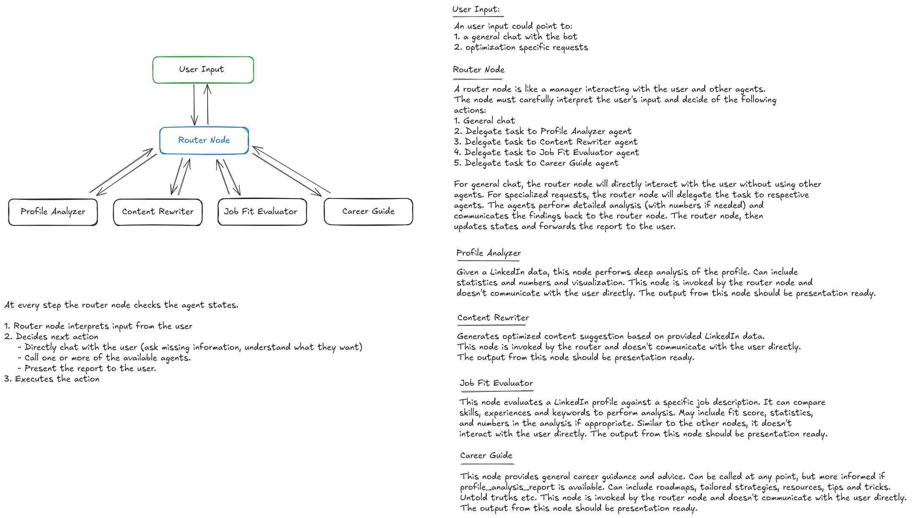

## User Input

A user input can be:

1. A general chat with the bot
2. An optimization-specific request

---

## Router Node

The router node acts as a manager, interpreting user input and coordinating with specialized agents. It determines the appropriate action:

1. General chat
2. Delegate to Profile Analyzer agent
3. Delegate to Content Rewriter agent
4. Delegate to Job Fit Evaluator agent
5. Delegate to Career Guide agent

- For general chat, the router node interacts directly with the user.
- For specialized requests, it delegates tasks to the relevant agent.
- Agents perform detailed analysis and return their findings to the router node.
- The router node updates states and presents the report to the user.

---

## Agents

### Profile Analyzer

- Analyzes LinkedIn data in depth, providing statistics, numbers, and visualizations.
- Invoked by the router node; does not communicate directly with the user.
- Output is presentation-ready.

### Content Rewriter

- Generates optimized content suggestions based on LinkedIn data.
- Invoked by the router node; does not communicate directly with the user.
- Output is presentation-ready.

### Job Fit Evaluator

- Compares a LinkedIn profile to a specific job description.
- Analyzes skills, experiences, and keywords; may include fit scores and statistics.
- Invoked by the router node; does not communicate directly with the user.
- Output is presentation-ready.

### Career Guide

- Provides general career guidance and advice.
- Can be called at any point, but is more effective with a profile analysis report.
- Offers roadmaps, tailored strategies, resources, and tips.
- Invoked by the router node; does not communicate directly with the user.
- Output is presentation-ready.

---

## Potential Workflow

At each step, the router node checks agent states:

1. Interprets user input
2. Decides next action:
    - Directly chat with the user (ask for missing information, clarify intent)
    - Call one or more agents
    - Present the report to the user
3. Executes the chosen action
